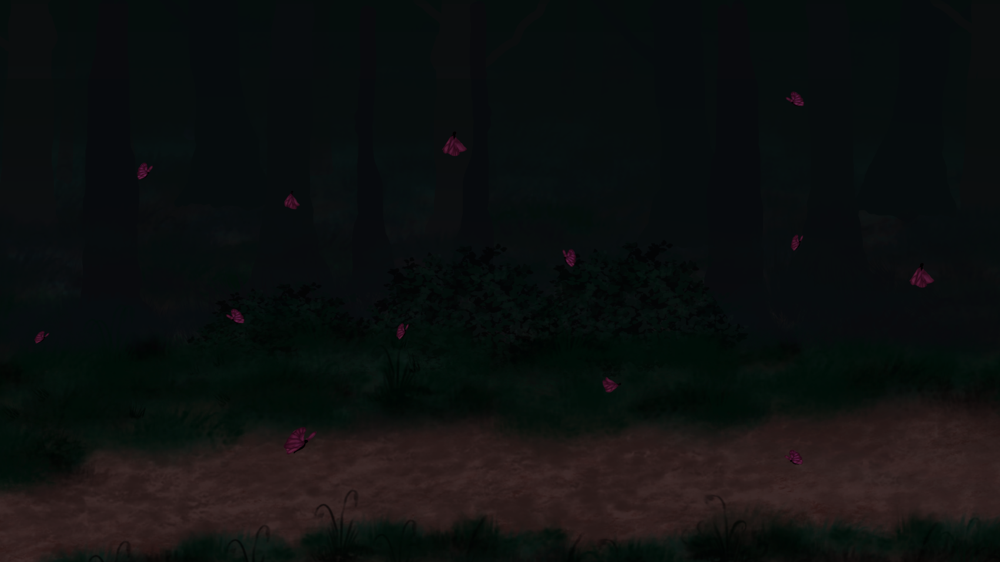
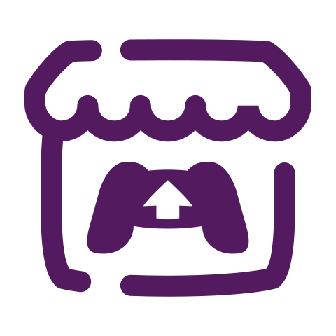
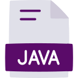
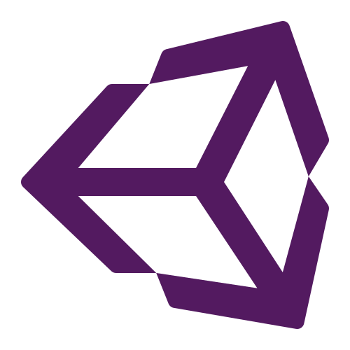

<h1 align="center" style="display: flex; align-items: center; color:#5A0B69;">
  Hello there!
  
</h1>

  
   
  

  

    <h3 align="center" style="color:#E0E0E9;">My name is Yasmin Constantino and this is my GitHub! 
      
    </h3>
    
 I’m currently studying Internet Systems Technology at IFSul.

    
 Fun fact: I was an artist before and I almost became a tattoo artist.

    
 I’m currently working on some projects to improve my skills and always learning about new things.

    <section>
       
      

        
<b>Clique aqui para ler em português</b>

        
Atualmente estou cursando Sistemas para Internet no IFSul.

        
Fato engraçado: Eu era uma artista, quase me tornei uma tatuadora. Mas continuo ilustrando.

        
Estou sempre trabalhando em projetos para praticar meus conhecimentos e habilidades, além de estar sempre aprendendo coisas novas. Terminei recentemente meu primeiro jogo.

      

    

    </section>
    <h4 align="center" >Contact me:</h4>
    

      
      
      
      
      
    

    

    

      <h4> Languages and Technologies:</h4>
      
      &#8287;&#8287;&#8287;&#8287;&#8287;
      
      &#8287;&#8287;&#8287;&#8287;&#8287;
      
      &#8287;&#8287;&#8287;&#8287;&#8287;
      
      &#8287;&#8287;&#8287;&#8287;&#8287;
      
      &#8287;&#8287;&#8287;&#8287;&#8287;
      
      &#8287;&#8287;&#8287;&#8287;&#8287;
      
      &#8287;&#8287;&#8287;&#8287;&#8287;
     
  

  

  <footer style="text-align:center; color:#5A0B69;">
  
Made with 💜 by Yasmin Constantino.

  </footer>
  

