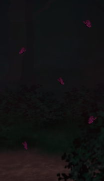

<h1 style="color:#5A0B69;">Hello there! </h1>

  <h3 style="color:#E0E0E9;"> My name is Yasmin Constantino and this is my GitHub! </h3>

   I’m currently studying Internet Systems Technology at IFSul.
   
   Fun fact: I was an artist before and I almost became a tattoo artist.
   
   I’m currently working on some projects to improve my skills and always learning about new things.

<section>
  

    
<b style="color:#5A0B69;">Clique aqui para ler em português</b>

    
Atualmente estou cursando Sistemas para Internet no IFSul.

    
Fato engraçado: Eu era uma artista, quase me tornei uma tatuadora. Mas continuo ilustrando.

    
Estou sempre trabalhando em projetos para praticar meus conhecimentos e habilidades, além de estar sempre aprendendo coisas novas. Terminei recentemente meu primeiro jogo.

  

</section>
<h4>Contact me:</h4>

  
  
  
  
  

<h4>Contact me:</h4>

  
  
  
  
  

<footer style="text-align:center; color:#5A0B69;">
  Made with 💜 by Yasmin Constantino.
</footer>
  
img:hover {
  transform: scale(1.1);
  transition: transform 0.3s ease-in-out;
}
<section>
  

    
     
     
    
  

</section>
