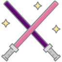

<h1> Hello there! </h1>

  <h3> My name is Yasmin Constantino and this is my github!  </h3>

  

      I’m currently studying Internet Systems Technology at IFSul.
     
      Fun fact: I was an artist before and I almost became a tattoo artist.
     
      I’m currently working on some projects to improve my skills and always learning about new things
     
  

  

<h4> You can find me and contact me:</h4>

  
    &#8287;&#8287;&#8287;&#8287;&#8287;
  
    &#8287;&#8287;&#8287;&#8287;&#8287;
  
    &#8287;&#8287;&#8287;&#8287;&#8287;
  
    &#8287;&#8287;&#8287;&#8287;&#8287;

 

  <h4> Languages and Technologies:</h4>
  
  &#8287;&#8287;&#8287;&#8287;&#8287;
  
  &#8287;&#8287;&#8287;&#8287;&#8287;
  
  &#8287;&#8287;&#8287;&#8287;&#8287;
  
  &#8287;&#8287;&#8287;&#8287;&#8287;
  
  &#8287;&#8287;&#8287;&#8287;&#8287;
  

<!--

      -->

<!--
**yasminconstantino/yasminconstantino** is a ✨ _special_ ✨ repository because its `README.md` (this file) appears on your GitHub profile.

Here are some ideas to get you started:

- 🌱 I’m currently learning ...
- 👯 I’m looking to collaborate on ...
- 🤔 I’m looking for help with ...
- 💬 Ask me about ...
- 📫 How to reach me: ...
- 😄 Pronouns: ...
-->
