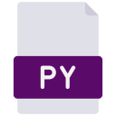

<h1 color="#5A0B69"> Hello there! </h1>

  <h3 color="#E0E0E9"> My name is Yasmin Constantino and this is my github!  </h3>

  

      I’m currently studying Internet Systems Technology at IFSul.
     
      Fun fact: I was an artist before and I almost became a tattoo artist. But i also still illustrating.
     
      I’m currently working on some projects to improve my skills and always learning about new things. I recently finished my first game.
     
  

 

<section>
  

    
Clique aqui para ler em português

     
    
Atualmente estou cursando Sistemas para Internet no IFSul.

    
Fato engraçado: Eu era uma artista, quase me tornei uma tatuadora. Mas também continuo ilustrando.

    
Estou sempre trabalhando em projetos para praticar meus conhecimentos e habilidades,a lém de estar sempre aprendendo coisas novas. Terminei recentemente meu primeiro jogo.

  

</section>
  

  
  <section>
  

  
   
  

   
  <h4> Contact me:</h4>
    
  

      
        &#8287;&#8287;&#8287;&#8287;&#8287;
      
        &#8287;&#8287;&#8287;&#8287;&#8287;
      
        &#8287;&#8287;&#8287;&#8287;&#8287;
      
        &#8287;&#8287;&#8287;&#8287;&#8287;
      
        &#8287;&#8287;&#8287;&#8287;&#8287;
  

    
   
  

      <h4> Languages and Technologies:</h4>
      
      &#8287;&#8287;&#8287;&#8287;&#8287;
      
      &#8287;&#8287;&#8287;&#8287;&#8287;
      
      &#8287;&#8287;&#8287;&#8287;&#8287;
      
      &#8287;&#8287;&#8287;&#8287;&#8287;
      
      &#8287;&#8287;&#8287;&#8287;&#8287;
      
      &#8287;&#8287;&#8287;&#8287;&#8287;
      
      &#8287;&#8287;&#8287;&#8287;&#8287;
     
  

  

</section>
 
 
 

 
 
 

<section>

<a href="https://github.com/yasminconstantino">
   
  
  

   

</section>
